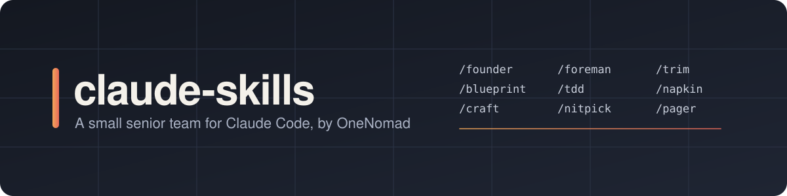
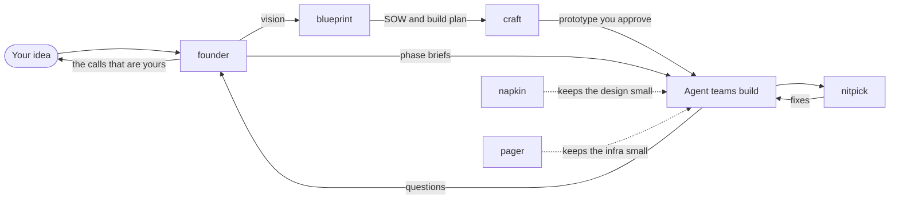

<p align="center">
  
</p>

<p align="center">
  <a href="LICENSE"></a>
  
  
</p>

<p align="center">
  <b>A founder, a designer, an architect, an ops engineer and a reviewer, each with strong opinions.</b><br>
  OneNomad's Claude Code plugins for taking an app from an idea to shipped code without the usual mess.
</p>

<p align="center">
  <a href="#install">Install</a> ·
  <a href="#the-team">The team</a> ·
  <a href="#how-they-fit-together">How they fit together</a> ·
  <a href="docs/GUIDE.md">Guide</a>
</p>

---

## Install

```
/plugin marketplace add OneNomad-LLC/claude-skills
/plugin install founder@claude-skills
```

Install the rest the same way, or only the ones you want. Restart Claude Code to load them. The [guide](docs/GUIDE.md) covers each one in detail.

## The team

| | Plugin | Role | You run it |
|---|---|---|---|
| 🧭 | [**founder**](plugins/founder) | Turns your vision into a vision doc and one-page briefs for agent teams, collects their questions and works through every open detail with you. | `/founder` |
| 📐 | [**blueprint**](plugins/blueprint) | Interviews you until it can write a full SOW, then a build plan sized for agent batches and a kickoff prompt. | `/blueprint` |
| 🎨 | [**craft**](plugins/craft) | Designs and builds premium interfaces: brief, taste picker, OKLCH tokens, a prototype for review, production code, screenshot checks. | `/craft` |
| 🧻 | [**napkin**](plugins/napkin) | Lazy senior architect. Fewest components that meet the real requirements, sized for today's scale. | always on |
| 📟 | [**pager**](plugins/pager) | Lazy senior DevOps. Fewest moving parts, managed over self-hosted, every change with a way back. | always on |
| 🔍 | [**nitpick**](plugins/nitpick) | Opinionated senior dev review: readable names, clean structure, no repetition, mainstream libraries. | `/nitpick` |

**Always on** means the plugin adds its rules at the start of every session and to every subagent, and the rules only kick in when the task is in its area. Switch them with `/napkin lite|full|ultra|off` and `/pager lite|full|ultra|off`.

## How they fit together



1. **Vision.** `/founder vision` talks the idea through and writes down where it goes, then hands off to blueprint.
2. **Scope.** blueprint interviews you, proposes an MVP cut and writes the SOW and build plan.
3. **Design.** `/craft` builds a prototype from the SOW for you to review before production code.
4. **Build.** `/founder brief` writes a brief for each phase. Agent teams build with napkin and pager keeping the architecture and infrastructure lean.
5. **Questions.** Teams drop questions in an inbox. `/founder questions` answers what's settled and brings you the rest.
6. **Review.** `/nitpick` reviews every change before it merges.

Each plugin also works on its own.

## Works well with

[ponytail](https://github.com/DietrichGebert/ponytail) by Dietrich Gebert does for application code what napkin and pager do for architecture and infrastructure. napkin and pager were modelled on it and run alongside it.

## Adding a plugin

1. Create `plugins/<name>/.claude-plugin/plugin.json`, then put skills in `plugins/<name>/skills/<skill>/SKILL.md` and agents in `plugins/<name>/agents/`.
2. Add the plugin to `.claude-plugin/marketplace.json` with `"source": "./plugins/<name>"`.
3. Copy `LICENSE` into the plugin folder. Installs copy only that folder. Third-party material needs its notice in the plugin's `NOTICE`.
4. Bump `version` in both `plugin.json` and the marketplace entry for every change you want installs to pick up. Claude Code caches each installed version, so a new commit under the same version reaches nobody.
5. Run `claude plugin validate .` and `claude plugin validate plugins/<name>`.

Secrets never go in this repo. Plugins read keys from the environment and document them in a `.env.example`. A pre-commit hook runs gitleaks, falling back to a pattern check when gitleaks isn't installed. In a fresh clone, turn it on with `git config core.hooksPath .githooks`.

## Licence

Apache-2.0, unless a plugin's `NOTICE` says a part of it comes from elsewhere.
